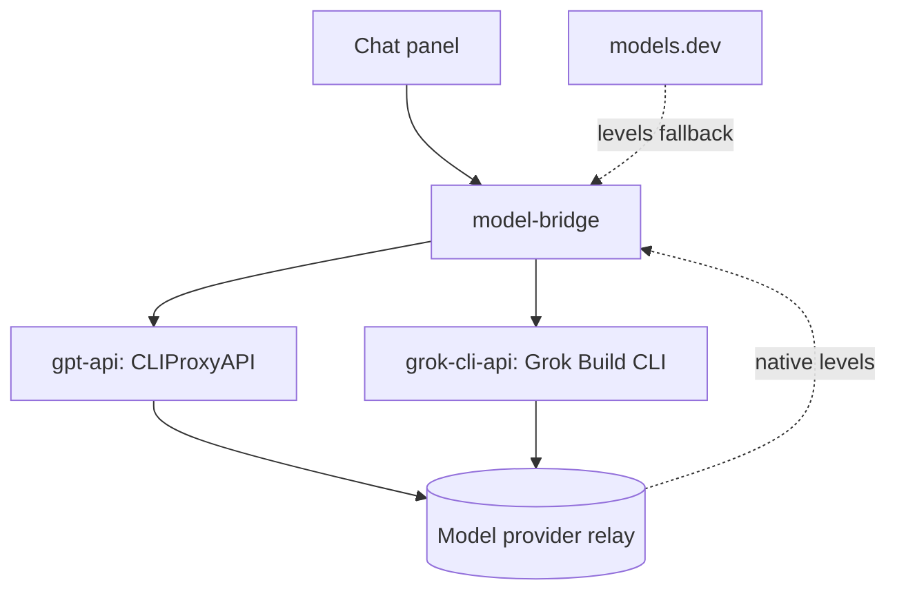

<div align="right">
  <strong>English</strong> | <a href="./docs/README.ru.md"><strong>Русский</strong></a>
</div>

# AI Model Gateway

<p align="center">
  One OpenAI-compatible endpoint for every model: CLI-grade backends, declarative routing, reasoning levels attached to the model list, and a tools memory — the chat panel connects once and never learns what happens inside.
</p>

<p align="center">
  
  
  
  
</p>

<p align="center">
  Single endpoint • CLI-grade backends • Declarative routing • Reasoning levels • Tools memory
</p>

<p align="center">
  <a href="#what-it-is">What it is</a> •
  <a href="#whats-inside">What's inside</a> •
  <a href="#workflow">Workflow</a> •
  <a href="#architecture">Architecture</a> •
  <a href="#quick-start">Quick start</a> •
  <a href="#troubleshooting">Troubleshooting</a>
</p>

<table>
  <tr>
    <td align="center"><strong>1</strong><br>endpoint and API key for every model</td>
    <td align="center"><strong>2</strong><br>CLI-grade backends behind the gateway</td>
    <td align="center"><strong>40+</strong><br>models in the live catalog</td>
    <td align="center"><strong>7 days</strong><br>tools-failure memory per model</td>
  </tr>
</table>

## What it is

**AI Model Gateway** — a gateway for any OpenAI-compatible chat panel: the panel connects once and gets the full model catalog without knowing which backend serves each model.

Behind the gateway:

- `gpt-*` models are served through CLIProxyAPI — the same requests the Codex CLI sends;
- every other model (grok, gemini, and the rest of the provider catalog) is served through the Grok Build CLI running as an HTTP service;
- each model carries its reasoning levels in the standard `reasoning_options` format — the panel's selector fills itself;
- if a model chokes on tools, the gateway answers without them instantly and remembers the model for a week.

What you get after connecting it:

- one URL and one API key;
- the full live catalog with reasoning levels;
- routing already configured — no panel-side model lists;
- no long waits on models that cannot use tools.

## What's inside

<table>
  <tr>
    <td width="33%"><strong>Single endpoint</strong><br>OpenAI-compatible <code>/v1</code>, one key, zero consumer-specific code.</td>
    <td width="33%"><strong>Declarative routing</strong><br>Rules live in <code>config.yaml</code>: backends in order, glob include/exclude, first backend that serves a model owns it.</td>
    <td width="33%"><strong>Reasoning levels attached</strong><br>Native provider catalog first, models.dev as the fallback; the <code>none</code> level is dropped when a model has others.</td>
  </tr>
  <tr>
    <td width="33%"><strong>Tools memory</strong><br>An upstream error with tools means an instant stripped retry plus a 7-day mark; a real success with tools clears it.</td>
    <td width="33%"><strong>Graceful degradation</strong><br>Failed backends are reported in the <code>/v1/models</code> response instead of being silently hidden.</td>
    <td width="33%"><strong>Consumer-agnostic</strong><br>No mentions of any chat panel in the code — anything that speaks OpenAI can connect.</td>
  </tr>
</table>

## Workflow

1. Fill `.env` with the provider relay keys.
2. `docker compose up -d --build`.
3. In any OpenAI-compatible panel add one connection: `http://model-bridge:8080/v1` with `BRIDGE_API_KEY` as the key.
4. Pick a model. If it has reasoning levels, the selector gets them from the model list automatically.
5. Use tools freely: a model that fails on them gets an instant stripped answer, and the next requests skip the wait for a week.

## Architecture



Components:

- `gpt-api` — CLIProxyAPI serving `gpt-*` through the Codex-grade channel;
- `grok-cli-api` — the Grok Build CLI wrapped into an HTTP API, model catalog pulled live from the provider;
- `model-bridge` — FastAPI aggregator: single endpoint, routing, reasoning levels, tools memory.

Architectural principles:

- routing is a static `config.yaml` — no env indirection inside it;
- the environment is strict: no silent defaults, a missing variable fails startup with a clear message;
- backends are internal-only; external ports are published by the optional override, bound to `127.0.0.1` by default;
- backends are polled in order, and a model is claimed by the first backend that serves it.

## Quick start

```bash
git clone https://github.com/KroJIak/ai-model-gateway.git
cd ai-model-gateway
cp .env.example .env
docker compose up -d --build
```

After the start:

- inside a docker network: `http://model-bridge:8080/v1`
- from the host: `http://localhost:8081/v1`
- authorization: `Authorization: Bearer <BRIDGE_API_KEY from .env>`

The shortest path:

1. Fill `.env`.
2. `docker compose up -d --build`.
3. Add the connection in the panel.
4. Chat.

## Minimal `.env` configuration

Fill `.env` based on `.env.example`. The variables that matter:

```env
BRIDGE_API_KEY=...

GROK_BASE_URL=...
GROK_API_KEY=...

GPT_PROVIDER_BASE_URL=...
GPT_PROVIDER_API_KEY=...
```

Important:

- in the reference setup both provider pairs point to the same model relay;
- `BRIDGE_API_KEY` is what the panel authenticates with;
- reasoning levels are read from the provider first and fall back to models.dev; the caches live for `PROVIDER_LEVELS_TTL` (1 hour) and `MODELSDEV_TTL` (24 hours);
- timing knobs (`BRIDGE_READ_TIMEOUT`, `GROK_API_TIMEOUT`, `TOOLS_RETRY_TTL_DAYS`) are also in `.env.example`.

## Repository structure

```text
bridge/        FastAPI aggregator: single endpoint, routing, levels, tools memory
grok-cli-api/  Grok Build CLI wrapped into an HTTP API with a live model catalog
docker/        CLIProxyAPI entrypoint: the Codex-grade channel for gpt-*
config.yaml    static routing rules: backends, include/exclude
```

## Documentation map

- [docs/README.ru.md](./docs/README.ru.md) — Russian version of this README

## Troubleshooting

### A model is missing from the list

- check `docker compose ps`
- check the `bridge.backends_down` field of `/v1/models`

### 401 on every request

- the panel key must match `BRIDGE_API_KEY` from `.env`

### A model has no reasoning levels

- the provider returned none and models.dev has no entry — expected for rare models; the panel simply hides the selector

### A model answers without tools

- it is in the 7-day tools memory; one successful upstream request with tools clears the mark

### Changed `.env` but nothing happens

```bash
docker compose down
docker compose up -d --build
```
