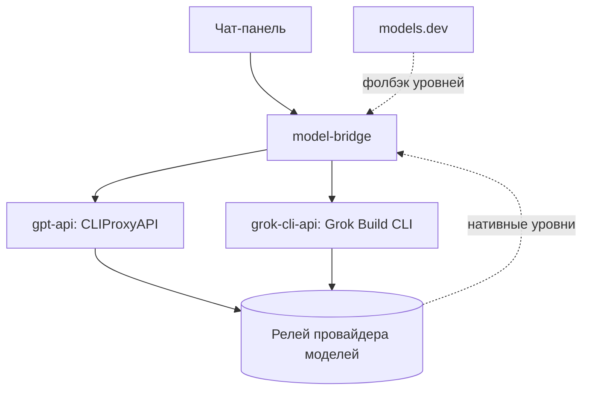

<div align="right">
  <a href="../README.md"><strong>English</strong></a> | <strong>Русский</strong>
</div>

# AI Model Gateway

<p align="center">
  Один OpenAI-совместимый endpoint для всех моделей: бэкенды уровня CLI, декларативная маршрутизация, уровни размышлений прямо в списке моделей и память инструментов — чат-панель подключается один раз и не знает, что происходит внутри.
</p>

<p align="center">
  
  
  
  
</p>

<p align="center">
  Один endpoint • Бэкенды уровня CLI • Декларативная маршрутизация • Уровни размышлений • Память инструментов
</p>

<p align="center">
  <a href="#что-это">Что это</a> •
  <a href="#что-внутри">Что внутри</a> •
  <a href="#сценарий-работы">Сценарий работы</a> •
  <a href="#архитектура">Архитектура</a> •
  <a href="#быстрый-запуск">Запуск</a> •
  <a href="#частые-проблемы">Частые проблемы</a>
</p>

<table>
  <tr>
    <td align="center"><strong>1</strong><br>endpoint и API-ключ на все модели</td>
    <td align="center"><strong>2</strong><br>CLI-бэкенда за шлюзом</td>
    <td align="center"><strong>40+</strong><br>моделей в живом каталоге</td>
    <td align="center"><strong>7 дней</strong><br>памяти о неудачах с инструментами</td>
  </tr>
</table>

## Что это

**AI Model Gateway** — шлюз для любой OpenAI-совместимой чат-панели: панель подключается один раз и получает весь каталог моделей, не зная, какой бэкенд какую модель обслуживает.

За шлюзом:

- модели `gpt-*` обслуживает CLIProxyAPI — те же запросы, что отправляет Codex CLI;
- все остальные модели (grok, gemini и весь каталог провайдера) обслуживает Grok Build CLI, запущенный как HTTP-сервис;
- каждая модель несёт свои уровни размышлений в стандартном формате `reasoning_options` — селектор в панели заполняется сам;
- если модель падает на инструментах, шлюз сразу отвечает без них и запоминает модель на неделю.

Результат подключения:

- один URL и один API-ключ;
- весь живой каталог с уровнями размышлений;
- маршрутизация уже настроена — никаких списков моделей на стороне панели;
- никаких долгих ожиданий на моделях, которые не умеют инструменты.

## Что внутри

<table>
  <tr>
    <td width="33%"><strong>Единый endpoint</strong><br>OpenAI-совместимый <code>/v1</code>, один ключ, ноль кода под конкретного потребителя.</td>
    <td width="33%"><strong>Декларативная маршрутизация</strong><br>Правила в <code>config.yaml</code>: бэкенды по порядку, glob include/exclude, модель закрепляется за первым, кто её отдаёт.</td>
    <td width="33%"><strong>Уровни размышлений</strong><br>Сначала нативный каталог провайдера, фолбэк — models.dev; уровень <code>none</code> убирается, если у модели есть другие.</td>
  </tr>
  <tr>
    <td width="33%"><strong>Память инструментов</strong><br>Ошибка бэкенда с инструментами — мгновенный повтор без них и пометка на 7 дней; успех с инструментами снимает пометку.</td>
    <td width="33%"><strong>Честная деградация</strong><br>Упавший бэкенд виден в поле <code>/v1/models</code>, а не спрятан.</td>
    <td width="33%"><strong>Независимость от потребителя</strong><br>Ни упоминаний чат-панелей в коде — подключается всё, что говорит на OpenAI.</td>
  </tr>
</table>

## Сценарий работы

1. Заполнить `.env` ключами релея провайдера.
2. `docker compose up -d --build`.
3. В любой OpenAI-совместимой панели добавить одно подключение: `http://model-bridge:8080/v1` с ключом `BRIDGE_API_KEY`.
4. Выбрать модель. Если у неё есть уровни размышлений, селектор получит их из списка моделей автоматически.
5. Инструменты — спокойно использовать: модель, которая на них падает, получит мгновенный ответ без них, а следующие запросы неделю не будут ждать.

## Архитектура



Состав:

- `gpt-api` — CLIProxyAPI, обслуживающий `gpt-*` через канал уровня Codex;
- `grok-cli-api` — Grok Build CLI в обёртке HTTP API, каталог моделей подтягивается из провайдера;
- `model-bridge` — агрегатор на FastAPI: один endpoint, маршрутизация, уровни размышлений, память инструментов.

Архитектурные принципы:

- маршрутизация — статический `config.yaml`, без подстановок из окружения;
- окружение строгое: тихих дефолтов нет, отсутствие переменной роняет старт с понятной причиной;
- бэкенды только внутренние; внешние порты публикует опциональный override с привязкой к `127.0.0.1` по умолчанию;
- бэкенды опрашиваются по порядку, модель закрепляется за первым, кто её отдаёт.

## Быстрый запуск

```bash
git clone https://github.com/KroJIak/ai-model-gateway.git
cd ai-model-gateway
cp .env.example .env
docker compose up -d --build
```

После старта:

- внутри docker-сети: `http://model-bridge:8080/v1`
- с хоста: `http://localhost:8081/v1`
- авторизация: `Authorization: Bearer <BRIDGE_API_KEY из .env>`

Самый короткий путь:

1. Заполнить `.env`.
2. Поднять `docker compose up -d --build`.
3. Добавить подключение в панели.
4. Общаться.

## Минимальная конфигурация `.env`

Заполняйте `.env` на основе `.env.example`. Минимально важные переменные:

```env
BRIDGE_API_KEY=...

GROK_BASE_URL=...
GROK_API_KEY=...

GPT_PROVIDER_BASE_URL=...
GPT_PROVIDER_API_KEY=...
```

Важно:

- в базовой конфигурации обе пары провайдера указывают на один релей моделей;
- `BRIDGE_API_KEY` — ключ, которым панель авторизуется в шлюзе;
- уровни размышлений читаются сначала у провайдера, фолбэк — models.dev; кэши живут `PROVIDER_LEVELS_TTL` (1 час) и `MODELSDEV_TTL` (24 часа);
- тайминги (`BRIDGE_READ_TIMEOUT`, `GROK_API_TIMEOUT`, `TOOLS_RETRY_TTL_DAYS`) тоже перечислены в `.env.example`.

## Структура репозитория

```text
bridge/        агрегатор на FastAPI: один endpoint, маршрутизация, уровни, память инструментов
grok-cli-api/  Grok Build CLI в обёртке HTTP API с живым каталогом моделей
docker/        entrypoint CLIProxyAPI: канал уровня Codex для gpt-*
config.yaml    статические правила маршрутизации: бэкенды, include/exclude
```

## Карта документации

- [docs/README.ru.md](./docs/README.ru.md) — русская версия этого README

## Частые проблемы

### Модели нет в списке

- проверьте `docker compose ps`
- проверьте поле `bridge.backends_down` в ответе `/v1/models`

### 401 на каждый запрос

- ключ в панели должен совпадать с `BRIDGE_API_KEY` из `.env`

### У модели нет уровней размышлений

- провайдер их не отдал, а в models.dev записи нет — для редких моделей это нормально; панель просто не покажет селектор

### Модель отвечает без инструментов

- она в недельной памяти инструментов; один успешный запрос с инструментами до бэкенда снимает пометку

### Изменил `.env`, ничего не поменялось

```bash
docker compose down
docker compose up -d --build
```
